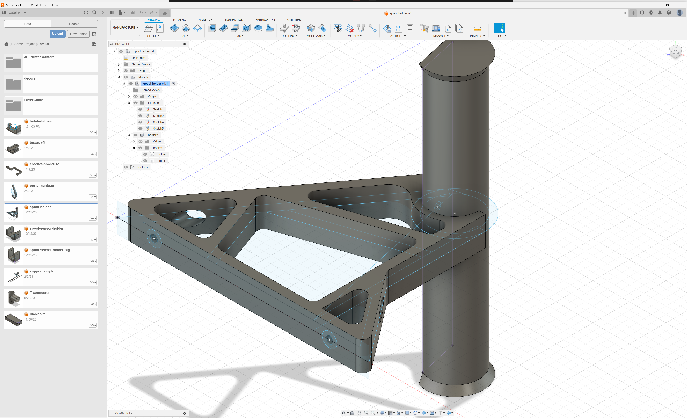

## Description

Dans ce tutoriel, vous apprendrez à mieux aborder le design, le slice et l'impression 3d fdm.

## Requirements

Pour ce tuto, il vous faudra:

- un logiciel de design 3d (recommandé: fusion360).
- un logiciel de slicing (recommandé: cura).

(*Note: ces logiciels sont installés sur le PC de la verriere*)

## Design 3D

Pour le design, vous pouvez utilisez ce que vous voulez: [Fusion360](https://www.autodesk.fr/products/fusion-360/overview) (licence Education possible via EPITA), [Blender](https://www.blender.org/) (FOSS, plutôt orienté modeling), [OpenSCAD](https://openscad.org/) (FOSS, scripting) ou autre.
Dans le process, n'oubliez pas de penser aux différentes contraintes d'impression.
Voici quelques conseils:

- Penser aux forces qui s'exerçeront sur la pièce.
- Les détails trop petits (moins d'un mm) ne seront difficilement imprimable.
- Éviter les overhang.
- Penser à la façon dont la pièce sera imprimée, la face qui sera en contact avec le bed sera la plus lisse. Plus cette face sera grande, plus la pièce sera stable.
- Utiliser des côtes en millimetres.
- Utiliser des tolérances pour les assemblages. Le plus souvent 0.2mm est suffisant. Par exemple, pour un axe de 10mm, le trou devrait faire 10.2mm voir 10.4mm.

### Un exemple de création d'objet

On a ici deux pièces qui sont conçues pour être assemblées. Ici la pièce est séparé en deux pour faciliter l'impression à plat sans supports.

### Résultat
À la fin de cette étape, on **exporte un fichier STL** (mesh 3D) pour le slicing.

## Slice

Pour Slice, nous utilisons [Cura](https://ultimaker.com/software/ultimaker-cura/) (FOSS), il est installé sur le PC du lab. Commencez par importer votre modèle: `ctrl+o`, ensuite le placer sur la face qui semble la mieux comme base -> grosse surface plane ou alors un plan qui permet d'imprimer la piece avec le moins de supports possible.

Il existe deux profils préconfigurés pour les imprimants wanhao: un pour la d12 230 et un autre pour la d12 300, ils sont update de temps en temps sur le repo `https://github.com/Atelier-Epita/cura`.
Il faut les importer dans CURA.
Pour les imprimantes Artillery, utiliser le profil déjà existant pour le bon modèle dans CURA, il donne de bons résultats.
Ces profils influent directement sur la qualité des impressions.
Vous pouvez si vous le souhaitez creer votre propre profil en dupliquant un existant.

Voici quelques parametres qui pourraient être interessant à modifier suivant vos besoins (bien sûr je vous invite a aller regarder la doc pour de plus amples déscriptions):

- layer height -> dépends directement de la taille de la buse, en général correspond à la moitié de la taille de la buse.
- line width -> largeur d'une ligne imprimé, dépends aussi de la taille de la buse, la plupart du temps elle correspond a peu pret à la largeur de la buse +/- 10%.
- vitesse d'impression -> l'augmenter permet d'imprimer plus vite, mais peut réduire la qualité de l'impression, les vitesses d'impression sont dépendantes de la taille de la buse, en général les proiles par défaut sont plutôt conservateurs par rapport à la qualité d'impression.
- infill density -> la densité des remplissages est importante si vous voulez faire des pièces où les contraintes sont importantes. Par défaut entre 15-20%, l'augmenter produira une pièce plus robuste mais demandera plus de temps a imprimer.
- supports -> votre pièce contient-elle de grands overhangs ? si oui: mettez des supports. Il existe également des supports en forme de tree, c'est parfois interessant de les utiliser.
- temperatures -> il y a deux températures que vous pouvez régler si jamais vous imprimer avec du filament autre que celui par défaut: la température de la buse et celle du plateau.
- plate adhesion -> pour certaines pièces, il est fortement recommandé de rajouter un raft ou un brim, ces deux méthodes permettent d'éviter que la pièce "warp" (voir la section troubleshooting pour plus d'information) en augmentant la surface de contact avec le bed.

### Un exemple de slice

### Résultat
À la fin de cette étape, on obtient un **fichier GCODE** (séquence de commande pour l'outil) qu'il faut enregistrer sur un clé USB ou une carte SD.

## Impression

Pour lancer l'impression, il suffit d'inserer la carte SD ou clef USB et de rentrer dans le menu "print" et cliquer sur votre fichier.
(*Note: il peut être utile de préchauffer l'imprimante pour eviter de perdre du temps lors du lancement de l'impression*)

L'imprimante se charge ensuite de lire le GCODE depuis le support. On peut distinguer 3 sections dans le gcode:

- start gcode -> la séquence d'instruction exécuté pour toutes les impressions. Elle permet l'initialisation des axes, de la temperature du plateau, de la buse, du néttoyage de la buse
- print -> le gcode généré par le slicer pour imprimer votre pièce.
- end gcode -> la séquence d'instruction de fin: refroidir la buse, le bed, lever la tête et la placer à l'origine.

Vous pouvez si vous le souhaiter modifier les gcode de start et de fin dans le tab `settings>printer>manage printers>machine settings` de cura.

Une fois l'impression terminée, retirer la pièce sans se brûler les doigts. Une spatule peut être utile. Attention à le pas rayer le support.

## Troubleshooting

Quelques problèmes courant et comment les fix dans la plupart des cas:

- warping -> Lorsque qu'un bord ou une partie de la pièce ne tient plus sur le bed. Dans 50% des cas c'est dû au design de la pièce, dans le cas écheant, rajouter un brim devrait amplement suffire. dans les 50 autres pourcents restant, recalibrer le plateau peut être une option, néttoyer le plateau, ou alors tout simplement imprimer le premier layer plus lentement.
- blobs -> Dû à une pression trop élevé dans la buse, des petits blobs se font apparaitre aux jointures lorsqu'une rétractation ou une pause a lieux. Pour réduire cet effet, on peut augmenter la distance de rétractation ou bien rajouter du coasting: relacher la pression de la buse avant chaque retraction en réduisant la vitesse d'extrusion.
- stringing -> L'impression possède des fils entre les différentes parties de la pièce. C'est dû à une rétractation trop faible, augmenter la rétractation devrait régler le problème.
